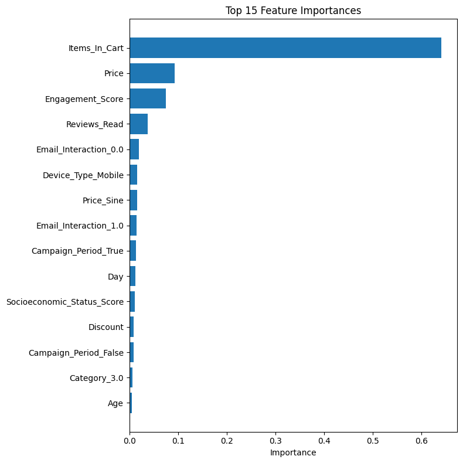
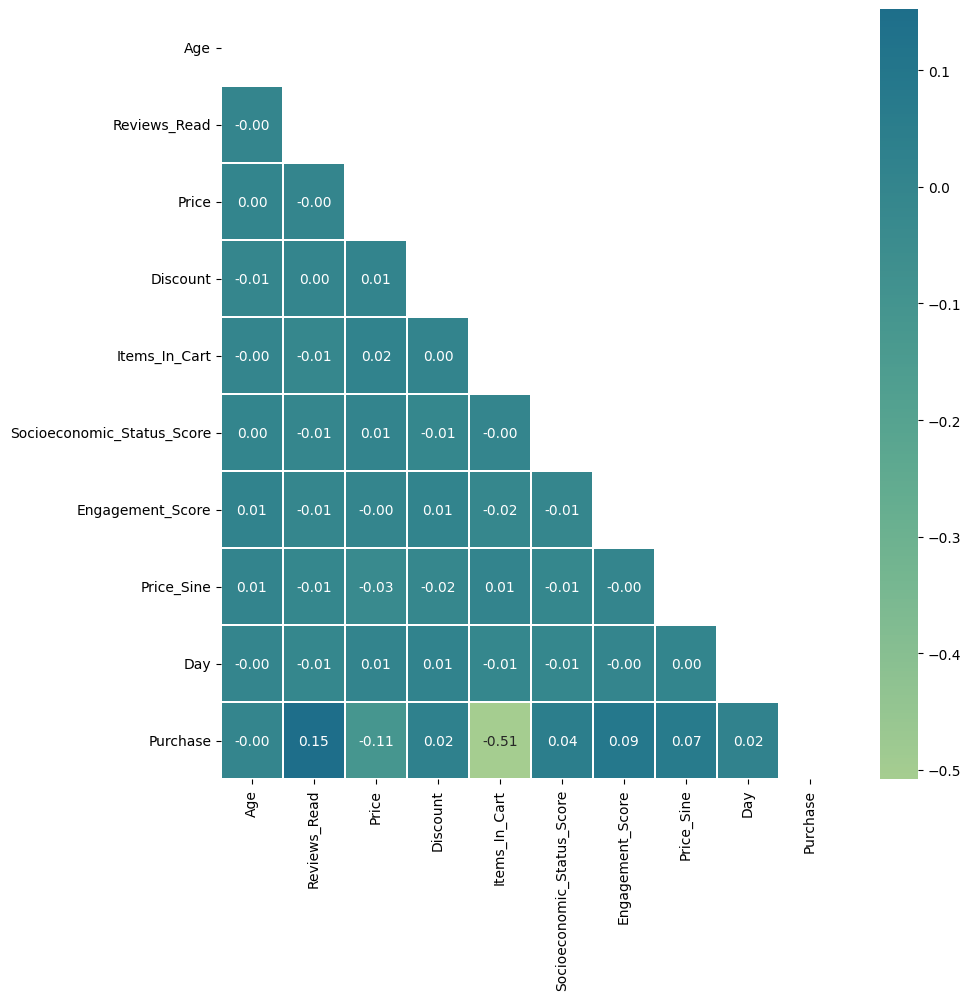
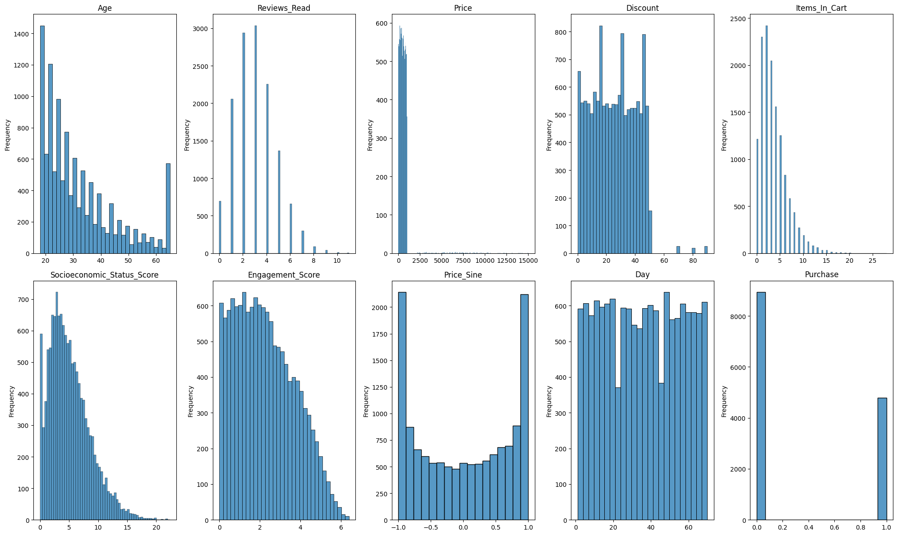

# E-Commerce Purchase Prediction

> Predicting session-level purchase behavior using ensemble machine learning

[](https://www.python.org/)
[](https://scikit-learn.org/)
[](https://xgboost.readthedocs.io/)

**Kaggle ML competition achieving F1-score of 0.75178**

---

## Project Overview

**Business Problem:** Predict whether an e-commerce session will result in a purchase, enabling targeted marketing and inventory optimization.

**Approach:** Ensemble of tree-based models (Random Forest + XGBoost) with systematic feature engineering and hyperparameter tuning.

**Key Results:**
- Final F1-Score: **0.75178**
- Handled class imbalance (35% positive rate)
- Minimal feature engineering (only missingness indicator) - let models learn
- Optimal probability threshold tuning: 0.519

---

## Installation
```bash
# Clone repository
git clone https://github.com/wengchienwei/ecommerce-purchase-prediction.git
cd ecommerce-purchase-prediction

# Install dependencies
pip install -r requirements.txt

# **Note:** Dataset not included (see License section).
# If you have access to similar e-commerce session data:
# 1. Place CSV in `data/` directory
# 2. Open `notebooks/purchase_prediction_analysis.ipynb`
# 3. Update data path in first cell
# 4. Run all cells
```

---

## Technical Stack

- **Models:** Random Forest, XGBoost, Weighted Ensemble
- **Techniques:** RandomizedSearchCV, threshold tuning, soft voting
- **Evaluation:** Stratified K-Fold CV, F1-score optimization
- **Tools:** scikit-learn, XGBoost, pandas, seaborn

---

## Key Findings

### Feature Importance


**Top 3 predictive features:**
1. **Items_in_Cart** (0.6 importance) - strong negative correlation with purchase
2. **Price** (0.09 importance)
3. **Engagement_Score** (0.07 importance)

### Model Performance

| Model | CV F1 | Kaggle F1 |
|-------|-------|-----------|
| Random Forest Baseline | 0.7736 | 0.7262 |
| XGBoost + Threshold Tuning | 0.8006 | 0.7497 |
| **Ensemble (Final)** | **0.8003** | **0.7518** |

---

## Repository Structure
```
.
├── notebooks/
│   └── purchase_prediction_analysis.ipynb   # Full analysis pipeline
├── report/
│   └── technical_report.pdf                 # Detailed methodology
├── figures/
│   ├── correlation_heatmap.png
│   ├── feature_distributions.png
│   └── feature_importances.png
├── requirements.txt
└── README.md
```

---

## Methodology

### 1. Feature Engineering
- Minimal approach: Only `Age_missing` indicator retained
- Tested interaction terms - removed due to overfitting
- Allowed tree models to perform implicit feature selection

### 2. Model Development
- **Random Forest:** Tuned depth, leaf size to control variance
- **XGBoost:** Regularization (L1/L2), learning rate, subsampling
- **Ensemble:** Weighted soft voting (w=0.89 for XGBoost)

### 3. Overfitting Prevention
- Stratified K-Fold cross-validation
- Early stopping in XGBoost
- Maximum depth limiting in RF
- Minimum samples per leaf constraints

---

## Visualizations

<details>
<summary>Correlation Heatmap</summary>


</details>

<details>
<summary>Feature Distributions</summary>


</details>

---

## Business Impact

**Potential applications:**
- **Targeted Marketing:** Identify high-intent sessions for real-time offers
- **Cart Abandonment:** Predict dropout risk, trigger interventions
- **Inventory Planning:** Forecast conversion rates by segment

**Model interpretability:** Feature importances reveal that cart behavior dominates—actionable insight for UX optimization.

---

## Author

**Chien-Wei WENG**  
MSc Data Sciences and Business Analytics  
CentraleSupélec × ESSEC Business School  

[](https://www.linkedin.com/in/chien-wei-weng-74a6881b8/)  

---

## License

Code: MIT License  
Dataset: Not included (proprietary to course)

---

*Academic Project | Foundation of Machine Learning (Fall 2025)*  
*Instructor: Prof. Fragkiskos Malliaros (CentraleSupélec)*

